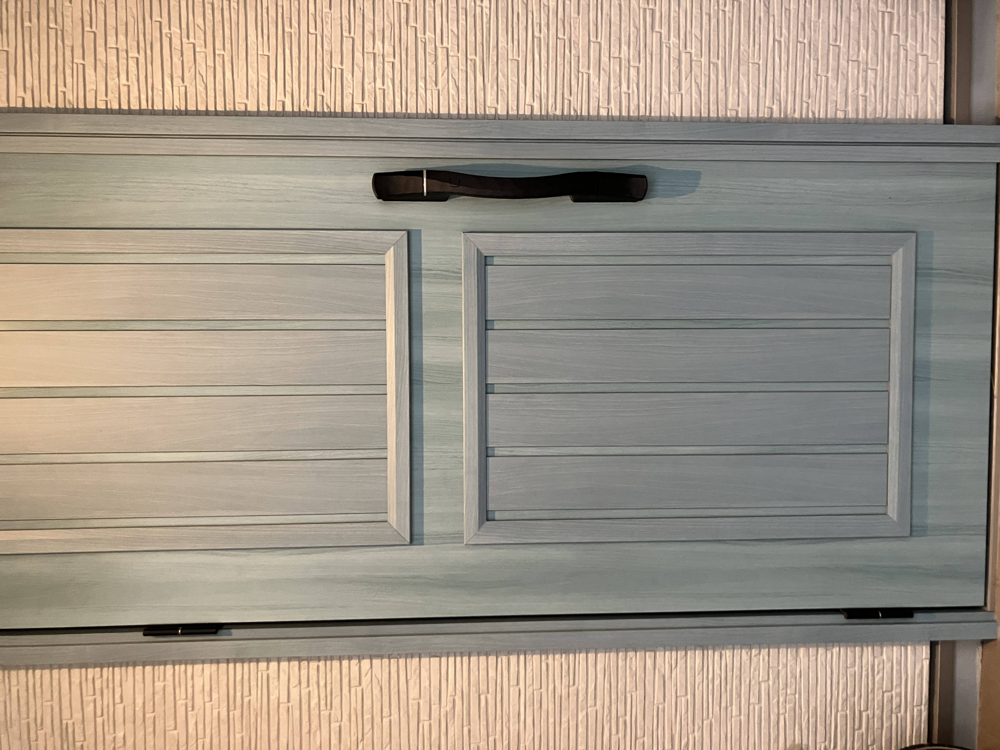

# fingerprint-door-lock
DIY fingerprint door lock for my home — no-drill, fail-safe, and hopefully cute.
自宅の玄関ドアに、後付けの指紋認証機能をつけるための個人開発プロジェクトです。

## やりたいこと

玄関の鍵を、指紋認証やパスワードで開けられるようにしたい。

市販のスマートロックをそのまま取り付けるのではなく、

* ドアにできるだけ穴を開けない
* 大きな機械をベタッと貼り付けない
* 現在の物理鍵も残す
* 電池切れや故障時にも締め出されない
* できれば見た目もかわいくする

という条件で、自作できないか試しています。

## なぜ作るのか

単純に、自分の家の玄関に指紋認証をつけたいからです。

既製品は、でっかいテンキーを玄関ドアに強力接着剤などでくっつけますが、つけたくないんです。

せっかく可愛い玄関ドアなのに、テンキーなんて・・テンキーなんて・・っておもってしまうわけです。

と思ったのがきっかけです。

まずは自宅用の試作品を完成させることを目標にします。

## 最初にやること

まずは小さく、

1. 指紋センサーで指紋を登録する
2. 指紋を読み取る
3. 認証成功／失敗を判定する
4. 認証成功時にLEDやモーターを動かす
5. 実際の鍵を動かす仕組みにつなげる

という順番で試します。

## 現在考えている技術要素

* ESP32などのマイコン
* 指紋認証センサー
* モーター／サーボ
* バッテリー・省電力
* Wi-Fi / Bluetooth
* 筐体
* 3Dプリント
* フェイルセーフ
* セキュリティ

まだ方式は確定していません。

## 大きな課題

特に考えたいのが、以下の部分です。

### ドアにどう取り付けるか

できるだけ、

* 穴を開けない
* ドアを傷つけない
* 落下しない
* 外側から簡単に取り外されない
* 原状回復しやすい

方式にしたいです。

ここはこのプロジェクトの大きなテーマになると思っています。

### 電池切れ・故障時

電子機器なので、必ず壊れる前提で考えます。

* 物理鍵を使えるようにする
* 電池切れでも締め出されない
* ネットワーク障害時にも基本機能を使えるようにする

などを検討します。

### 見た目

機能だけではなく、玄関に置いて違和感のないデザインにしたいです。

最終的には「後付け感の少ない、かわいい指紋認証ロック」を目指します。

## このリポジトリについて

設計途中のメモ、コード、試作、失敗、検討中の案も含めて公開していきます。

まだ正解は決まっていません。

「この方式の方がよさそう」
「ここ危なくない？」
「この部品使えるかも」
「自分ならこう作る」

など、技術的なツッコミ・提案・アイデア歓迎です。

IssueやDiscussionなどで気軽にコメントしてください。

## 現在のステータス

**Phase 1: 指紋認証を動かす**

まずは机上で、指紋センサーによる登録・認証を動かすところから始めます。

その後、

指紋認証
→ モーター制御
→ 鍵の解錠
→ ドアへの固定
→ 筐体・デザイン

の順で進める予定です。

